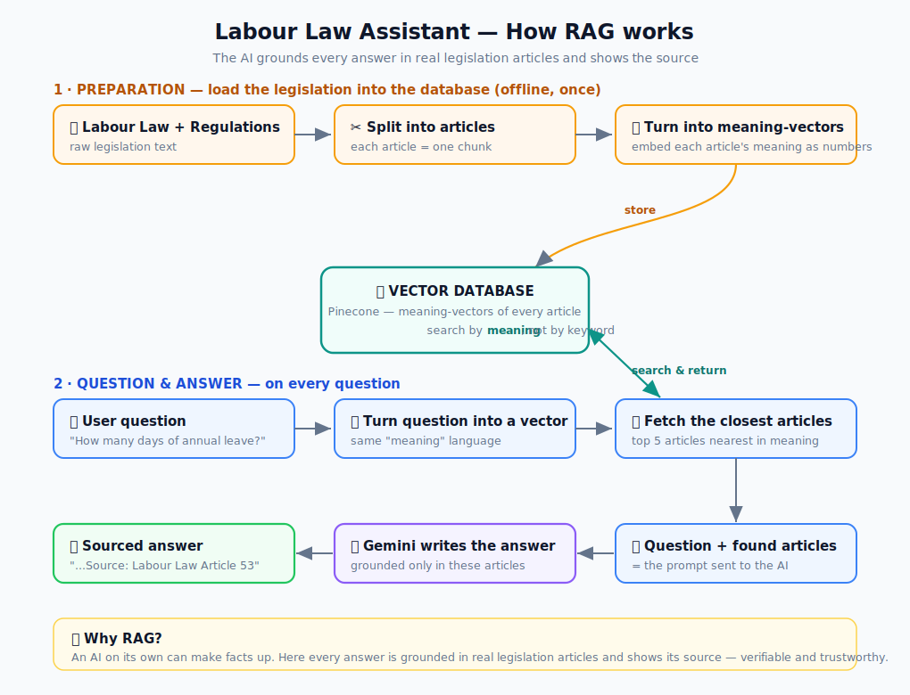

# Turkish Labour Law (İş Kanunu) AI Assistant

A RAG-based question-answering app over Turkish labour law legislation. Ask a question in natural language, get an answer grounded in the actual law — with the source article shown and expandable.

**Live demo:** [labor-law-ai-chatbot.vercel.app](https://labor-law-ai-chatbot.vercel.app)

---

## What it does

Users ask questions like *"Yıllık iznim kaç gün?"* or *"Kıdem tazminatı nasıl hesaplanır?"* and get a plain-Turkish answer (no legalese) that cites the specific article from the İş Kanunu. Answers stream in live as the model generates them, and the source reference is clickable — you can read the original article text right in the UI. No hallucinated answers without backing.

## How it works (RAG pipeline)



1. Turkish labour law legislation is pre-chunked by article and embedded with **Gemini embeddings** into **Pinecone**
2. When a question comes in, it's embedded the same way and matched against the stored vectors
3. The top matching articles are passed as context to **Gemini API**, which generates the answer
4. The answer and source chunks (with article numbers) are returned to the frontend

## Stack

| Layer | Technology |
|---|---|
| Frontend | Next.js 16 (App Router), TypeScript, Tailwind CSS |
| AI service | Python, FastAPI |
| Embeddings | Gemini (`gemini-embedding-001`) |
| LLM | Gemini 3.1 |
| Vector DB | Pinecone |
| Local dev | Docker Compose |
| Deploy | Vercel (frontend) + Render (AI service) |

## Architecture

```
Browser → Vercel (Next.js)
           └─ /api/chat  ──→  Render (FastAPI)
                                ├─ EmbeddingService  → Gemini API
                                ├─ VectorRepository  → Pinecone
                                └─ LLMService        → Gemini API
```

The FastAPI service is layered (routes → services → repositories) with the vector DB abstracted behind an interface — swap Pinecone for another store without touching business logic.

## Evaluation

This RAG app is **measured**, with a reproducible offline eval harness in `backend/eval/`:

- **Ground-truth test set** — 30 natural-language questions (25 answerable + 5 off-topic), several adapted from the official Ministry of Labour (CSGB) İş Kanunu FAQ, each mapped to the article(s) that actually contain the answer and verified against the source legislation. The answerable set includes deliberately hard multi-part, exact-number and colloquially phrased questions.
- **Two-layer scoring** (retrieval and generation fail independently, so they're measured separately):
  - *Retrieval* — is the correct article fetched? **recall@5 = 96%, recall@1 = 80%**.
  - *Answer correctness* — an **LLM-as-judge** grades each generated answer against a source-grounded reference answer: **96% correct**, **96%** citing the right article.
- **Abstention** — a tuned relevance-score gate makes off-topic questions return *"not in my scope"* with **zero** sources, instead of confidently citing irrelevant law: **100%** on the off-topic set.

```bash
python eval/evaluate_retrieval.py    # retrieval recall@k
python eval/evaluate_answers.py      # LLM-as-judge answer correctness
```

The harness is reproducible — rerun it after any change to catch regressions.

## Running locally

```bash
# Copy and fill in env vars
cp backend/.env.example backend/.env
cp frontend/.env.example frontend/.env.local

# Start both services
docker compose up
```

Open [localhost:3000](http://localhost:3000).
